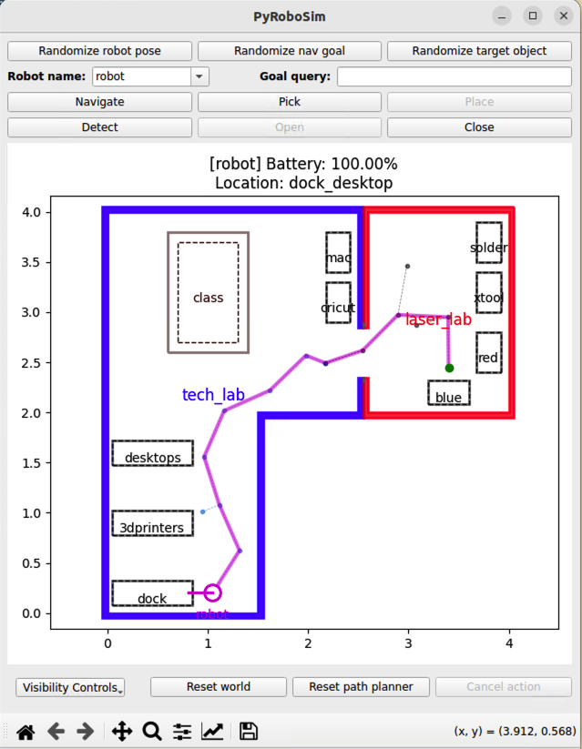

# Barney
Repository for all code related to the BARN Barney greeting robot.

The project will use Ubuntu 22.04 and ROS2 Humble as a starting point.

Table of Contents:

  - [Overview](#overview)
  - [Demo](#demo)
  - [Project Structure](#projectstructure)
  - [Installation](#installation)
  - [Usage](#usage)
  - [Contributions](#contributions)
  - [Acknowledgments](#acknowledgments)

## Overview

We are going to start the Barney project by simulating a greeting robot in [PyRoboSim](https://pyrobosim.readthedocs.io/en/latest/).

PyRoboSim is a lightweight 2D mobile robot simulator for behaviour prototyping. We use PyRoboSim to create a custom world of each of the BARN building floors using a BARN floor plan. It includes defining the office rooms and studios, hallways, some locations and objects from pick-and-place tasks. We use the PyRoboSim demo robot. To control the robots, we can use the GUI, python scripts or ROS actions/services.

The first step is to give a tour of the BARN Tech Lab.

## Demo



## Project Structure

```plaintext
Barney/                 # Barney project Root
├── src/                # Source code
├── INSTALL_MAC.md      # Install instructions for MAC
├── INSTALL_Ubuntu.md   # Install instructions for Linux/Ubuntu
├── INSTALL_WINDOWS.md  # Install instructions for Windows
├── LICENSE.md          # License
├── README.md           # README
```

## Installation

The native installation for this project is on Ubuntu 22.04 LTS (Jammy Jellyfish) with ROS2 Humble. You can find information about these platforms at:

- https://releases.ubuntu.com/jammy/
- https://docs.ros.org/en/humble/Installation.html

There are installation instructions for [Ubuntu](./INSTALL_Ubuntu.md), [MAC](./INSTALL_MAC.md) and [Windows](./INSTALL_Windows.md). For MAC and Ubuntu, we will use a Docker virtual environment. Windows will use WSL (Windows Subsytem for Linux).

## Usage

If you have properly setup your environment using one of the INSTALL files above, you should be able to use the following command to start a local copy of PyRoboSim. Note that all of the commands below must be run in a Docker interactive shell when using the Barney Humble Docker image.

```bash
cd /Barney/src/pyrobosim # Use ~/Barney/src/pyrobosim for Windows
python3 examples/barn_tech_lab.py
```

To run under ROS (which is the preferred way to run, as we will be using ROS on the physical robot), you must execute these commands once a session (not needed if running a Docker container).

```bash
cd /Barney/            # Use ~/Barney/ in WSL (no Docker)
. install/setup.bash
```

To run the pyrobosim graphical interface, run the following command:

```bash
ros2 run pyrobosim_ros barn_tech_lab.py
```

To run the Tech Lab tour, use the following command (using a ROS2 launch file).

```bash
ros2 launch pyrobosim_ros barn_commands.launch.py mode:=plan
```

Starting a new terminate, you can ask the robot to navigate to a new goal with the following command:

```bash
ros2 run pyrobosim_ros barn_commands.py --ros-args -p mode:=3dprinters
```

## Contributions

To contribute to this repository, you must first clone this repository

```bash
git clone https://github.com/BainbridgeArtisanResourceNetwork/Barney.git

```
We recommend that you create a new branch for your work, and merge your changes into main when you are confident that the changes are tested and working.

Another way to work from this repository is to fork it, and then clone your fork. That will allow you to work independently within your repository, and if you want to contribute back to this original repository, you can open a Pull Request of your changes back to here. There is further documentation on this process here: [Collaborating with Pull Requests and Forks](https://docs.github.com/en/pull-requests/collaborating-with-pull-requests/working-with-forks/fork-a-repo)

We strongly recommend that you use the Docker images on both Ubuntu and MAC. This will require you to learn and install Docker. See https://docs.docker.com/get-started/. We also provide a 'local setup' for both when developing on Windows and running on Robot hardware (Raspberry Pi).
  
## Acknowledgments

Thanks to Sebastian Castro, the owner and maintainer of the [PyRoboSim simulator](https://pyrobosim.readthedocs.io/en/latest/), for creaing this useful open-source tool. All rights and license for PyRoboSim used in this project belongs to Sebastian Castro.
